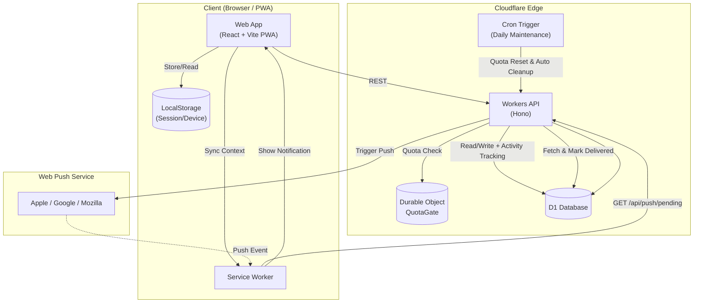

# renrakun

`renrakun` is a household request messenger PWA built for tap-only interactions.  
It keeps "Need to buy / Want to visit" requests out of daily chat noise with a dedicated panel + inbox workflow.

## MVP Features

- Touch-panel UI for fast request creation
- Group join via invite link + passphrase (with token-based manual join available for iOS Home Screen app use)
- Request status flow: `Requested` / `In progress` / `Completed`
- Lock-screen push summaries (who + what)
- Always-on in-app notification setup guide after login (iOS / Android / PC)
- Group creator can manage custom tabs/items/places (add + archive-delete)
- Request template switch: `Need to buy` / `Want to visit`
- Visual cart feedback (`+` to add items, `-` to reduce from cart)
- `Want to visit` is place-only (items are cleared on switch, single place selection with quick clear)
- Free-tier guardrails (daily limits, auto resume, staged cleanup)

## Architecture & Tech Stack

- **Web**: React + TypeScript + Vite + `vite-plugin-pwa` (Cloudflare Pages)
- **API**: Cloudflare Workers (Hono) + D1
- **State**: Durable Objects (QuotaGate)
- **Shared**: `packages/shared` (Zod schemas + shared types)
- **Monorepo**: pnpm workspace



## Local Development Setup

1. Install dependencies

```bash
pnpm install
```

2. Prepare env files

```bash
cp apps/web/.env.example apps/web/.env
cp apps/api/.dev.vars.example apps/api/.dev.vars
```

- Set `VITE_API_BASE_URL=http://127.0.0.1:8787` in `apps/web/.env`
- Set `APP_ORIGIN=http://localhost:5173` in `apps/api/.dev.vars`
- For push testing, generate keys with `npx web-push generate-vapid-keys --json` and set values in both files

3. Apply local migrations

```bash
cd apps/api
pnpm wrangler d1 migrations apply renrakun --local
```

4. Start dev servers

```bash
# Terminal 1: API
pnpm dev:api

# Terminal 2: Web
pnpm dev:web
```

## Production Setup

1. Apply remote migrations (initial + schema updates)

```bash
cd apps/api
pnpm wrangler d1 migrations apply renrakun --remote
```

2. Register push secrets

```bash
cd apps/api
npx wrangler secret put VAPID_PRIVATE_KEY
npx wrangler secret put VAPID_PUBLIC_KEY
npx wrangler secret put VAPID_SUBJECT
```

## CI/CD

- API: GitHub Actions -> Cloudflare Workers auto deploy
- Web: Cloudflare Pages auto build/deploy
- API migrations in CI run with:

```bash
d1 migrations apply renrakun --remote --auto-confirm
```

This avoids interactive prompts in GitHub Actions.

## Push Troubleshooting

If push is not arriving, check in this order:

0. Check the "How to enable notifications" card in the app
   - iOS: open in Safari, add to Home Screen, then enable notifications from the Home Screen web app (required)
   - Android/PC: allow browser notifications, then use `Enable notifications/Resync notifications` in the app
   - PC notifications are best-effort. Mobile is most reliable (on iOS, Home Screen web app is required).
   - If you plan to use the iOS Home Screen app, Safari-joined session state may not carry over. Share/copy the token and join from `Join Group` inside the Home Screen app when needed.
1. Tap `Resync notifications` in the app
2. Check member push state in `Members in group`
3. Verify migration status (`--local` / `--remote`)
4. Check API logs via `wrangler tail`

Notification delivery rules:
- New request: sent to notification-enabled members except the sender
- In progress / Complete: sent to the original request sender

## PWA Lifecycle & Data Sync (Specifications)

- The client is delivered and updated through the Service Worker update flow; reinstall is not part of the release/update model.
- A new Service Worker activates (`skipWaiting` + `clientsClaim`). The UI bundle is picked up by a client reload that is intentionally triggered when the document transitions to background (`visibilityState: hidden`) to avoid disruptive mid-task reloads.
- Private data refresh policy (authenticated sessions only) is a hybrid strategy:
  - push-driven refresh via Service Worker `postMessage` (`REFRESH_DATA`),
  - refresh on `focus` / `online` / `visibilitychange` (return to visible),
  - visible-only polling every 45 seconds.
- Auto-sync refresh is serialized and throttled (minimum interval: 5 seconds) and is suppressed while an explicit load is in progress.
- A manual `Refresh` action remains available as a fallback mechanism.

## Specifications & Limitations

- **Notification Support**: On iOS, Web Push works from the Home Screen web app only. On Android/PC, browser notification permission is sufficient.
- **Privacy**: Lock-screen summaries can expose request text; avoid sensitive data in requests.
- **Write Limits**: APIs are paused at daily free-tier limits and auto-resume at 00:00 JST to protect infrastructure.
- **Retention**: Completed requests are purged after 14 days by default. "Requested" and "In progress" statuses are not auto-purged.
- **Unused Groups**: Based on `last_activity_at`, groups meeting conservative criteria (e.g., single member, no push setup) are staged for cleanup via Cron Trigger (60-day candidate period + 30-day grace).
- **Custom Place Cleanup**: Place deletion is archive-first. Archived custom places with no remaining request references are physically removed in daily maintenance after retention.
- **Scope**: Price comparison, inventory sync, and external e-commerce integrations are out of MVP scope.
