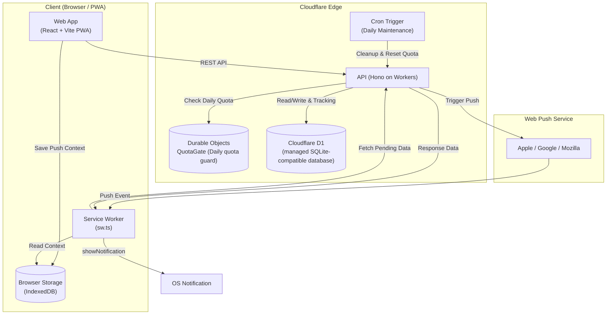

# renrakun

`renrakun` is a household request messenger PWA built for tap-only interactions.  
It keeps "Need to buy / Want to visit" requests out of daily chat noise with a dedicated panel + inbox workflow.

## MVP Features

- Touch-panel UI for fast request creation
- Group join via invite link + passphrase (with token-based manual join available for iOS Home Screen app use)
- Request status flow: `Requested` / `In progress` / `Completed`
- Lock-screen push summaries (who + what)
- Always-on in-app notification setup guide after login (iOS / Android / PC)
- Group creator can manage custom tabs/items/places (add + archive-delete)
- Request template switch: `Need to buy` / `Want to visit`
- Visual cart feedback (`+` to add items, `-` to reduce from cart)
- `Want to visit` is place-only (items are cleared on switch, single place selection with quick clear)
- Free-tier guardrails (daily limits, auto resume, staged cleanup)

## 🛠 Architecture & Tech Stack (Why We Chose What We Chose)

This project is built as a communication app for families and small groups. The core requirements were **"zero-barrier entry for non-tech-savvy family members"** and **"low-cost, low-maintenance operations within the free tier."** To achieve this realistic balance, we adopted the following stack:

* **Web (Frontend): React + TypeScript + Vite + `vite-plugin-pwa` (Cloudflare Pages)**
  * **Why:** Asking family members to download an app from a store adds unnecessary friction. We chose a PWA so users can join instantly via a shared URL, delivering a comfortable, app-like experience purely through web standards.
  * **Design Detail:** Utilizes Service Worker caching for a snappy, reliable UX (iOS-specific Push/background constraints are mitigated via an always-on in-app setup guide).

* **API (Backend): Hono (running on Cloudflare Workers) + D1**
  * **Why:** Cloudflare's Edge environment (utilizing V8 Isolates) helps reduce cold-start delays, providing the low-latency feel essential for a daily-use messaging app. 
  * **Design Detail:** By pairing it with D1 (a managed SQLite-compatible serverless database), we keep infrastructure management within a single ecosystem to minimize operational overhead and cost.

* **Abuse Protection (Daily Quota Guard): Cloudflare Durable Objects (`QuotaGate`)**
  * **Why:** To protect our free-tier D1 database (daily write limits) from accidental infinite loops or spam requests.
  * **Design Detail:** Instead of relying on an external Redis, we utilize a Durable Object as a "single global state coordinator." It persists daily write counters via the Storage API, safely blocking requests when limits are reached and resetting daily (JST).

* **Shared (Type Safety): `packages/shared` (Zod)**
  * **Why:** Structured as a monorepo via `pnpm workspace`. To avoid the overhead of maintaining OpenAPI generation pipelines in a small-scale project, we directly share Zod schemas between the frontend and backend.
  * **Design Detail:** This approach detects type and schema drift early, alongside strict **runtime payload validation**, ensuring high type safety with minimal boilerplate.

* **Push Notifications: Service Worker + Web Push API**
  * **Why:** We implemented self-hosted VAPID signing rather than relying on additional third-party SaaS like Firebase (keys are securely managed via Workers Secrets).
  * **Privacy First:** To minimize the risk of exposing sensitive request details on lock screens or through OS-level push providers, the push payload only sends a minimal trigger signal. The Service Worker then securely fetches the full details from our API.



## Local Development Setup

1. Install dependencies

```bash
pnpm install
```

2. Prepare env files

```bash
cp apps/web/.env.example apps/web/.env
cp apps/api/.dev.vars.example apps/api/.dev.vars
```

- Set `VITE_API_BASE_URL=http://127.0.0.1:8787` in `apps/web/.env`
- Set `APP_ORIGIN=http://localhost:5173` in `apps/api/.dev.vars`
- For push testing, generate keys with `pnpm dlx web-push generate-vapid-keys --json` and set values in both files

3. Apply local migrations

```bash
cd apps/api
pnpm wrangler d1 migrations apply renrakun --local
```

4. Start dev servers

```bash
# Terminal 1: API
pnpm dev:api

# Terminal 2: Web
pnpm dev:web
```

## Production Setup

1. Apply remote migrations (initial + schema updates)

```bash
cd apps/api
pnpm wrangler d1 migrations apply renrakun --remote
```

2. Register push secrets

```bash
cd apps/api
pnpm wrangler secret put VAPID_PRIVATE_KEY
# Note: Use `pnpm dlx wrangler secret put ...` if running outside the project workspace
pnpm wrangler secret put VAPID_PUBLIC_KEY
pnpm wrangler secret put VAPID_SUBJECT
```

## CI/CD

- API: GitHub Actions -> Cloudflare Workers auto deploy
- Web: Cloudflare Pages auto build/deploy
- API migrations in CI run with:

```bash
pnpm wrangler d1 migrations apply renrakun --remote
```

This typically runs without interactive prompts in CI environments.

## Push Troubleshooting

If push is not arriving, check in this order:

0. Check the "How to enable notifications" card in the app
   - iOS: open in Safari, add to Home Screen, then enable notifications from the Home Screen web app (required)
   - Android/PC: allow browser notifications, then use `Enable notifications/Resync notifications` in the app
   - PC notifications are best-effort. Mobile is most reliable (on iOS, Home Screen web app is required).
   - If you plan to use the iOS Home Screen app, Safari and the Home Screen app are handled separately. Share/copy the invite link or token and join from `Join Group` inside the Home Screen app.
1. Tap `Resync notifications` in the app
2. Check member push state in `Members in group`
3. Verify migration status (`--local` / `--remote`)
4. Check API logs via `wrangler tail`

Notification delivery rules:
- New request: sent to notification-enabled members except the sender
- In progress / Complete: sent to the original request sender

## PWA Lifecycle & Data Sync (Specifications)

- The client is delivered and updated through the Service Worker update flow; reinstall is not part of the release/update model.
- A new Service Worker activates (`skipWaiting` + `clientsClaim`). The UI bundle is picked up by a client reload that is intentionally triggered when the document transitions to background (`visibilityState: hidden`) to avoid disruptive mid-task reloads.
- Private data refresh policy (authenticated sessions only) is a hybrid strategy:
  - push-driven refresh via Service Worker `postMessage` (`REFRESH_DATA`),
  - refresh on `focus` / `online` / `visibilitychange` (return to visible),
  - visible-only polling every 45 seconds (currently configured default).
- Auto-sync refresh is serialized and throttled (minimum interval: 5 seconds / default) and is suppressed while an explicit load is in progress.
- A manual `Refresh` action remains available as a fallback mechanism.

## Specifications & Limitations (*Values rely on current configured defaults*)

- **Notification Support**: On iOS, Web Push works from the Home Screen web app only. On Android/PC, browser notification permission is sufficient.
- **Privacy**: Lock-screen summaries can expose request text; avoid sensitive data in requests.
- **Write Limits**: APIs are paused at daily free-tier limits and auto-resume at 00:00 JST (based on current timezone implementation logic) to protect infrastructure.
- **Retention**: Completed requests are purged after 14 days by default. "Requested" and "In progress" statuses are not auto-purged.
- **Unused Groups**: Based on `last_activity_at`, groups meeting conservative criteria (e.g., single member, no push setup) are staged for cleanup via Cron Trigger (currently configured: 60-day candidate period + 30-day grace).
- **Custom Place Cleanup**: Place deletion is archive-first. Archived custom places with no remaining request references are physically removed in daily maintenance after retention.
- **Scope**: Price comparison, inventory sync, and external e-commerce integrations are out of MVP scope.

## ⚙️ Config & Magic Numbers
The specific limits, retention periods, and intervals mentioned in this document rely on the following codebase constants. Refer to these files for the source of truth if configurations change:

* **Daily API Reset (JST):** Handled via `apps/api/src/time.ts` (`getJstDateString`) and `apps/api/src/quota-do.ts`.
* **Cron Cleanup Retention (14 days for completed / 60+30 days for groups):** Hardcoded in SQL queries within the `/cron/daily` endpoint in `apps/api/src/index.ts`.
* **PWA Polling Intervals (45s poll / 5s throttle):** Configured in frontend hooks within `apps/web/src/App.tsx` and related files.
