# renrakun

`renrakun` is a household restock messenger PWA focused on tap-only interactions.  
It keeps shopping requests out of daily chat noise by using a dedicated ordering-style interface and inbox.

## MVP Features

- Touch-panel UI to add household items and send requests quickly
- Push notifications + in-app inbox for group members
- Request status flow: `requested` / `acknowledged` / `completed`
- Admin-only custom tabs and custom item buttons per group
- Daily free-tier guard: write APIs pause on quota and auto-resume at 00:00 JST

## Architecture & Tech Stack

This application is built on a Cloudflare-native serverless architecture, combining a React frontend with a Workers/D1 API:

```mermaid
graph TD
    subgraph Client ["📱 Client (Browser / PWA)"]
        UI["React Web App<br/>(Vite)"]
        LS[("LocalStorage<br/>(Session / UUID)")]
        SW["Service Worker<br/>(Web Push)"]
    end

    subgraph Cloudflare ["☁️ Cloudflare Edge Network"]
        API["Workers (Hono)<br/>API Server"]
        DO[("Durable Objects<br/>(QuotaGateDO)")]
        DB[("D1 (SQLite)<br/>Relational Database")]
        CRON(("Cron Triggers<br/>(Scheduled Events)"))
    end

    subgraph External ["🌐 External Services"]
        PushService["Push Provider<br/>(Apple / Google / Mozilla)"]
    end

    %% Client Interactions
    UI -- "1. Read/Write Keys" --> LS
    UI -- "2. REST API (HTTPS)" --> API
    
    %% Backend Interactions
    API -- "3. Query / Mutate" --> DB
    API -- "4. Check Limit" --> DO
    CRON -- "5. Daily GC & Quota Reset" --> API
    
    %% Push Notification Flow
    API -- "6. Web Push Protocol" --> PushService
    PushService -. "7. Deliver Notification" .-> SW
    SW -. "8. Show Alert" .-> UI

    classDef cf fill:#f38020,stroke:#d36000,stroke-width:2px,color:white;
    classDef client fill:#00a4d3,stroke:#007b9f,stroke-width:2px,color:white;
    classDef ext fill:#6c757d,stroke:#495057,stroke-width:2px,color:white;
    classDef db fill:#0051c3,stroke:#003a8c,stroke-width:2px,color:white;

    class API,CRON cf;
    class DB,DO db;
    class UI,LS,SW client;
    class PushService ext;
```



- **Web (Frontend):** React + TypeScript + Vite + `vite-plugin-pwa`. Delivered globally via Cloudflare Pages.
- **API (Backend):** Cloudflare Workers (Hono) + D1 (SQLite-based Edge DB).
- **State Management:** Durable Objects for daily quota rate-limiting.
- **Shared:** Zod schemas and domain types in `packages/shared`.
- **Monorepo:** pnpm workspace.

## Local Development Setup

1. Install dependencies:

```bash
pnpm install
```

2. Prepare environment files:

```bash
cp apps/web/.env.example apps/web/.env
cp apps/api/.dev.vars.example apps/api/.dev.vars
```

- Set `VITE_API_BASE_URL=http://127.0.0.1:8787` in `apps/web/.env`.
- Set `APP_ORIGIN=http://localhost:5173` in `apps/api/.dev.vars` (local CORS origin).
- If you test push, run `npx web-push generate-vapid-keys --json` and set values in `apps/api/.dev.vars` plus `VITE_VAPID_PUBLIC_KEY` in `apps/web/.env`.
- Keep `APP_ORIGIN` in `wrangler.toml` as the production URL. During `pnpm dev:api` (`wrangler dev`), `.dev.vars` overrides it for local development.

3. Run local D1 migrations:

```bash
cd apps/api
pnpm wrangler d1 migrations apply renrakun --local
```

`--local` applies to local D1 state under `.wrangler/state`, not to Cloudflare production D1.

4. Run development servers:

```bash
# Terminal 1: API
pnpm dev:api

# Terminal 2: Web
pnpm dev:web
```

## Production Setup (Initial + Schema Updates)

1. Apply migrations to production D1 (initial setup and whenever schema changes):

```bash
cd apps/api
pnpm wrangler d1 migrations apply renrakun --remote
```

2. Register push secrets in Cloudflare:

```bash
cd apps/api
npx wrangler secret put VAPID_PRIVATE_KEY
npx wrangler secret put VAPID_PUBLIC_KEY
npx wrangler secret put VAPID_SUBJECT
```

- If `VAPID_SUBJECT` is stored as a Secret, you do not need to hardcode an email in `wrangler.toml`.
- Request creation still works without `VAPID_*`, but Web Push delivery is skipped.
- Completed request retention can be tuned with `COMPLETED_RETENTION_DAYS` (default: `30` days). Use `0` or below to disable auto-purge.
- Daily maintenance also uses capped guardrails for free-tier protection: `MAINTENANCE_MAX_DELETE_PER_RUN` (default `2000`) and `MAINTENANCE_MAX_BATCHES_PER_RUN` (default `20`), while deletion criteria follow the `COMPLETED_RETENTION_DAYS` setting.

## Use As PWA (End Users)

1. iPhone (Safari): open app URL -> Share -> `Add to Home Screen`
2. Android (Chrome): open app URL -> menu -> `Add to Home Screen`
3. After install, tap the in-app Enable Notifications button and allow notifications

## CI/CD & Deployment

This repository implements an automated CI/CD pipeline using GitHub Actions and Cloudflare Pages.

- **API:** Automatically deployed to Cloudflare Workers via GitHub Actions when backend-related files are pushed to the `main` branch.
- **Web:** Automatically built and deployed by Cloudflare Pages on repository updates.

## How to use (Dev flow)

1. Create a group in the web app (display name + passphrase).
2. Share the invite token with your family member.
3. Select tab -> tap items -> optionally choose store -> send.
4. Receiver marks the request as `acknowledged`, then `completed`.

## Why not just use chat apps?

- No typing for regular request operations.
- Dedicated request inbox separated from daily chat conversations.
- Visible outstanding requests and status transitions.
- Household-oriented default catalog and quick buttons.

## Specifications & Limitations

- **Push notifications**: On iOS, Web Push availability depends on OS version, Home Screen installation status, and notification permission settings.
- **Write limits**: To stay within Cloudflare free-tier limits, write APIs are rate-limited after the daily cap is reached (auto-resets at 00:00 JST).
- **History cleanup**: Completed requests are auto-purged after 30 days by default (`COMPLETED_RETENTION_DAYS` can override this).
- **Scope**: This MVP does not include features such as price comparison, inventory management, or external e-commerce integrations.
