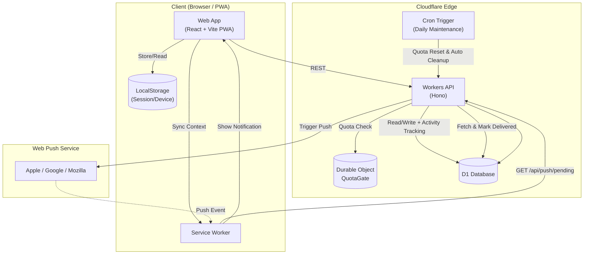

# れんらくん (renrakun)

`renrakun` は、家庭内の「買ってほしい / 行きたい」依頼をタップ操作だけで共有する PWA です。  
日常チャットに埋もれやすい依頼を、専用UIと受信箱で管理します。

## できること (MVP)

- タッチパネルUIで項目や場所を選び、素早く依頼送信
- 招待リンク + 合言葉でグループ参加（アカウント登録なし）
- 依頼ステータス管理（`依頼中` / `対応中` / `完了`）
- Push通知でロック画面に依頼要約（誰が・何を）を表示
- ログイン後に通知セットアップガイドを常設表示（iOS / Android / PC）
- グループ作成者によるカスタム管理
  - カスタムタブ追加/削除
  - カスタムアイテム追加/削除
  - カスタム場所（店舗など）の追加/削除
- 依頼テンプレ切替（`買ってほしい` / `行きたい`）
- カート操作の可視化（アイテム `＋` で追加、カート `−` で減算）
- `行きたい` は場所のみ送信（切替時にアイテムはクリア、場所は単一選択）
- 無料枠保護（日次制限・自動復帰・段階的クリーンアップ）

## アーキテクチャと技術スタック

- **Web**: React + TypeScript + Vite + `vite-plugin-pwa`（Cloudflare Pages）
- **API**: Cloudflare Workers (Hono) + D1
- **State**: Durable Objects（QuotaGate）
- **Shared**: `packages/shared`（Zodスキーマと共通型）
- **Monorepo**: pnpm workspace



## ローカル開発セットアップ

1. 依存関係インストール

```bash
pnpm install
```

2. 環境変数ファイル作成

```bash
cp apps/web/.env.example apps/web/.env
cp apps/api/.dev.vars.example apps/api/.dev.vars
```

- `apps/web/.env` の `VITE_API_BASE_URL` を `http://127.0.0.1:8787` に設定
- `apps/api/.dev.vars` の `APP_ORIGIN` を `http://localhost:5173` に設定
- Pushテスト時は `npx web-push generate-vapid-keys --json` で鍵を生成し、`.dev.vars` と `.env` に設定

3. ローカルDBへマイグレーション適用

```bash
cd apps/api
pnpm wrangler d1 migrations apply renrakun --local
```

4. 開発サーバー起動

```bash
# Terminal 1: API
pnpm dev:api

# Terminal 2: Web
pnpm dev:web
```

## 本番セットアップ

1. 本番D1へマイグレーション適用（初回 + スキーマ変更時）

```bash
cd apps/api
pnpm wrangler d1 migrations apply renrakun --remote
```

2. Push用Secrets登録

```bash
cd apps/api
npx wrangler secret put VAPID_PRIVATE_KEY
npx wrangler secret put VAPID_PUBLIC_KEY
npx wrangler secret put VAPID_SUBJECT
```

## CI/CD

- API: GitHub Actions から Workers へ自動デプロイ
- Web: Cloudflare Pages で自動ビルド/デプロイ
- APIマイグレーションは CI で次を実行（対話プロンプト回避）

```bash
d1 migrations apply renrakun --remote --auto-confirm
```

## Pushトラブルシュート

通知が届かない場合は次の順で確認してください。

0. ログイン後上部の「通知の使い方」カードでOS別手順を確認
   - iOS: Safariで開き、「ホーム画面に追加」したWebアプリから通知を有効化（必須）
   - Android/PC: ブラウザ通知を許可し、アプリ内 `通知を有効化/再同期` を実行
   - PC通知はベストエフォートです。スマホ利用（iOSはホーム画面アプリ）が最も安定します。
1. アプリ内 `通知を再同期` を実行
2. `参加中メンバー` カードで通知状態（通知OK / 通知未設定）を確認
3. マイグレーション適用状況（`--local` / `--remote`）を確認
4. `wrangler tail` で APIログを確認

通知配信ルール:
- 新しい依頼: 送信者以外の通知ONメンバーへ配信
- 対応中/完了: 依頼送信者へ配信

## PWAのライフサイクルとデータ同期

- クライアントの更新は Service Worker のアップデートフローによって行われます。
- 新しい Service Worker は `skipWaiting` によってアクティブ化されます。UIの更新（リロード）は、ユーザーの操作を妨げないよう、アプリがバックグラウンド（`visibilityState: hidden`）になったタイミングで実行されます。
- プライベートデータの更新ポリシー：
  - Service Worker からの `REFRESH_DATA` 通知によるプッシュ型更新
  - 画面のフォーカス時、オンライン復帰時、または可視性変更時の自動更新
  - 表示中のみ実行される 45秒間隔のポーリング
- 同期処理はスロットリング（最小 5秒間隔）され、明示的なロード中は抑制されます。

## 仕様・制限事項

- **通知対応**: iOSのWeb Pushはホーム画面に追加したWebアプリ起動が前提です。Android/PCはブラウザ通知許可で利用できます。
- **プライバシー**: 通知要約はロック画面に表示されるため、機微情報の送信は避けてください。
- **書き込み制限**: 無料枠保護のため、API書き込みは日次上限に達すると一時停止し、翌 0:00 JST に自動復帰します。
- **依頼の保持**: 「完了」済みの依頼は既定14日後に自動削除されます。「依頼中」「対応中」は自動削除しません。
- **未使用グループ**: `last_activity_at` を基準に、メンバー1名のみ・通知設定なし等の条件を満たす場合に段階整理されます（候補化60日 + 猶予30日）。
- **カスタム場所の整理**: 削除操作はアーカイブ方式です。参照がなく保持期間を超えたアーカイブ済みカスタム場所は、日次メンテで段階的に物理削除されます。
- **スコープ**: 本MVPに価格比較・在庫管理・EC連携は含みません。
