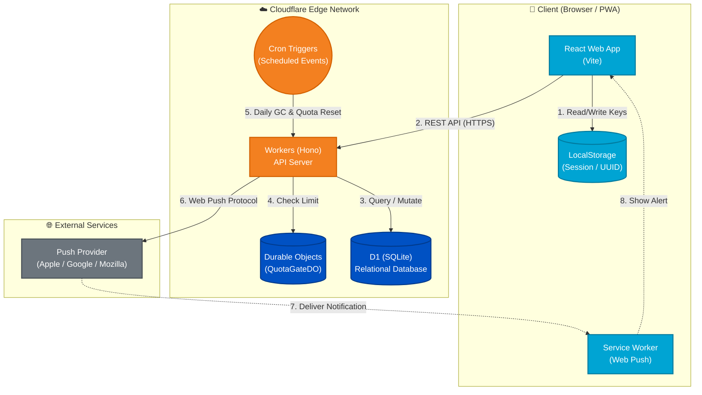

# れんらくん (renrakun)

家庭の消耗品を「入力なしのタップ操作」で共有する PWA です。  
日常のチャットの会話ログに埋もれないよう、依頼を専用 UI と専用受信箱で管理します。

## できること（MVP）

- タッチパネル型 UI で消耗品をカートに追加して依頼送信
- グループ内メンバーへ Push 通知 + 受信箱イベント配信
- 依頼ステータス管理（`依頼中` / `対応中` / `購入完了`）
- 管理者のみ、グループ専用タブ・アイテムを追加可能
- 無料枠超過時は書き込み停止し、翌日 0:00 JST に自動復帰

## アーキテクチャと技術スタック

本アプリは、Reactによるフロントエンドと、Workers/D1ベースのAPIを組み合わせた、Cloudflareネイティブなサーバーレス・アーキテクチャで構築されています。



- **Web (Frontend):** React + TypeScript + Vite + `vite-plugin-pwa` (Cloudflare Pages から配信)
- **API (Backend):** Cloudflare Workers (Hono) + D1 (SQLiteベースのEdge DB)
- **State Management:** Durable Objects を用いた日次の書き込み制限（Quota）管理
- **Shared:** `packages/shared` に Zod スキーマと共通型を配置
- **Monorepo:** pnpm workspace

## 開発環境のセットアップ

1. 依存関係のインストール:

```bash
pnpm install
```

2. 環境変数ファイルの準備:

```bash
cp apps/web/.env.example apps/web/.env
cp apps/api/.dev.vars.example apps/api/.dev.vars
```

- `apps/web/.env` の `VITE_API_BASE_URL` を `http://127.0.0.1:8787` に設定
- `apps/api/.dev.vars` の `APP_ORIGIN` を `http://localhost:5173` に設定（ローカルCORS用）
- Push通知をテストする場合は `npx web-push generate-vapid-keys --json` で鍵を生成し、`apps/api/.dev.vars` と `apps/web/.env` に設定
- `wrangler.toml` の `APP_ORIGIN` は本番用URLのままでOKです。`pnpm dev:api`（`wrangler dev`）実行時は `.dev.vars` の値が優先されます

3. ローカル用 D1 マイグレーション:

```bash
cd apps/api
pnpm wrangler d1 migrations apply renrakun --local
```

`--local` は Cloudflare の本番D1ではなく、ローカルの `.wrangler/state` 配下にある D1 へ適用されます。
- 画面で「データを読み込めませんでした」と出た場合は、DBリセット前に `migrations apply` の適用状況と API ログを確認してください。

4. 開発サーバーの起動:

```bash
# Terminal 1: API
pnpm dev:api

# Terminal 2: Web
pnpm dev:web
```

## 本番セットアップ（初回 + スキーマ変更時）

1. 本番DBへマイグレーション適用（初回および構造変更時）:

```bash
cd apps/api
pnpm wrangler d1 migrations apply renrakun --remote
```

2. Push通知の機密値を Cloudflare Secrets に登録:

```bash
cd apps/api
npx wrangler secret put VAPID_PRIVATE_KEY
npx wrangler secret put VAPID_PUBLIC_KEY
npx wrangler secret put VAPID_SUBJECT
```

- `VAPID_SUBJECT` を Secret 登録していれば、`wrangler.toml` にメールアドレスを書く必要はありません。
- `VAPID_*` が未設定でも依頼送信は動作しますが、Web Push は送信されません。
- 完了済み依頼の保持期間は `COMPLETED_RETENTION_DAYS`（既定 `14` 日）で調整できます。`0` 以下で自動削除を無効化できます。
- 日次メンテ処理には無料枠保護の上限もあり、`MAINTENANCE_MAX_DELETE_PER_RUN`（既定 `2000`）と `MAINTENANCE_MAX_BATCHES_PER_RUN`（既定 `20`）で1回実行あたりの処理量を制限します（※削除対象の判定は COMPLETED_RETENTION_DAYS の設定に従います）。
- 未使用グループは中間条件（作成60日超・未完了依頼0件・メンバー1人・Push登録0件・カスタム0件）で削除予定化され、30日猶予後に自動削除されます。`UNUSED_GROUP_CANDIDATE_DAYS` / `UNUSED_GROUP_DELETE_GRACE_DAYS` / `MAINTENANCE_MAX_UNUSED_GROUPS_PER_RUN` / `MAINTENANCE_MAX_UNUSED_GROUP_BATCHES_PER_RUN` で調整できます。
- アプリ画面上にもデータ保持ポリシーを常設表示しています（READMEを見なくても確認可能）。

## PWAとして使う（利用者向け）

1. iPhone (Safari): 公開URLを開く -> 共有 -> `ホーム画面に追加`
2. Android (Chrome): 公開URLを開く -> メニュー -> `ホーム画面に追加`
3. 初回起動後、アプリ内の通知有効化ボタンを押して許可

## CI/CD とデプロイ

本リポジトリは GitHub Actions および Cloudflare Pages の連携機能を用いた自動デプロイ（CI/CD）パイプラインを構築しています。

- **API:** `main` ブランチへの Push 時、バックエンド関連ファイルの変更がある場合に GitHub Actions を経由して Cloudflare Workers へ自動デプロイされます。
- **Web:** リポジトリの更新を Cloudflare Pages が検知し、自動でビルド・デプロイが行われます。

## 使い方（開発版）

1. Web画面からグループを作成（表示名・合言葉）
2. 招待リンクを相手に共有し、相手が表示名・合言葉で参加（必要ならトークン手動入力も可能）
3. タブからアイテムをタップしてカートに追加し、送信
4. 受信側で `対応する` / `購入完了` にステータスを更新

## 一般的なチャットアプリとの違い

- 文字入力不要で依頼を送れる
- 日常の会話と話題が混ざらない専用受信箱
- 未対応の依頼が可視化される
- 家庭内運用に特化した固定のカタログとUI

## 仕様・制限事項

- **Push通知**: iOS環境ではOSバージョンやホーム画面への追加状況、通知許可設定により、通知が利用できない場合があります。
- **書き込み制限**: Cloudflareの無料枠内で運用するため、書き込み系APIは日次上限に達すると制限がかかります（翌日 0:00 JST に自動復帰）。
- **履歴の自動整理**: `購入完了` にした依頼は既定で14日後に自動削除されます（`COMPLETED_RETENTION_DAYS` で変更可）。`依頼中` / `対応中` は自動削除されません。
- **スコープ**: 本MVP版には、価格比較・在庫管理・外部EC連携などの機能は含まれていません。
