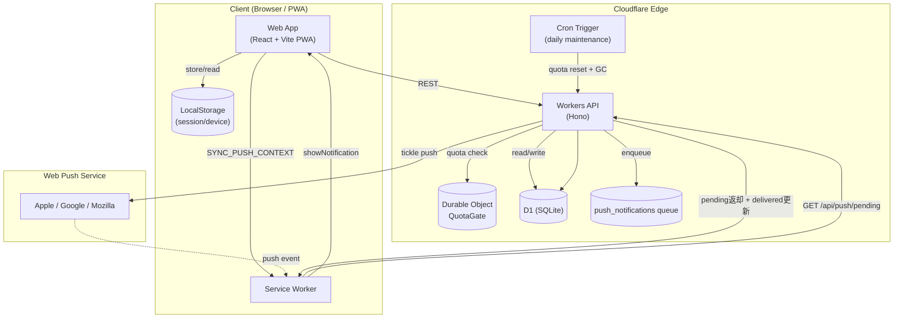

# れんらくん (renrakun)

`renrakun` は、家庭内の買い物依頼をタップ操作だけで共有する PWA です。  
日常チャットに埋もれやすい依頼を、専用UIと受信箱で管理します。

## できること (MVP)

- タッチパネルUIで消耗品を選び、素早く依頼送信
- 招待リンク + 合言葉でグループ参加（アカウント登録なし）
- 依頼ステータス管理（`依頼中` / `対応中` / `購入完了`）
- Push通知でロック画面に依頼要約（誰が・何を）を表示
- グループ作成者によるカスタムタブ・カスタムアイテム管理
- 無料枠保護（日次制限・自動復帰・段階的クリーンアップ）

## アーキテクチャと技術スタック

- **Web**: React + TypeScript + Vite + `vite-plugin-pwa`（Cloudflare Pages）
- **API**: Cloudflare Workers (Hono) + D1
- **State**: Durable Objects（QuotaGate）
- **Shared**: `packages/shared`（Zodスキーマと共通型）
- **Monorepo**: pnpm workspace



## ローカル開発セットアップ

1. 依存関係インストール

```bash
pnpm install
```

2. 環境変数ファイル作成

```bash
cp apps/web/.env.example apps/web/.env
cp apps/api/.dev.vars.example apps/api/.dev.vars
```

- `apps/web/.env` の `VITE_API_BASE_URL` を `http://127.0.0.1:8787` に設定
- `apps/api/.dev.vars` の `APP_ORIGIN` を `http://localhost:5173` に設定
- Pushテスト時は `npx web-push generate-vapid-keys --json` で鍵を生成し、`.dev.vars` と `.env` に設定

3. ローカルDBへマイグレーション適用

```bash
cd apps/api
pnpm wrangler d1 migrations apply renrakun --local
```

4. 開発サーバー起動

```bash
# Terminal 1: API
pnpm dev:api

# Terminal 2: Web
pnpm dev:web
```

## 本番セットアップ

1. 本番D1へマイグレーション適用（初回 + スキーマ変更時）

```bash
cd apps/api
pnpm wrangler d1 migrations apply renrakun --remote
```

2. Push用Secrets登録

```bash
cd apps/api
npx wrangler secret put VAPID_PRIVATE_KEY
npx wrangler secret put VAPID_PUBLIC_KEY
npx wrangler secret put VAPID_SUBJECT
```

## CI/CD

- API: GitHub Actions から Workers へ自動デプロイ
- Web: Cloudflare Pages で自動ビルド/デプロイ
- APIマイグレーションは CI で次を実行（対話プロンプト回避）:

```bash
d1 migrations apply renrakun --remote --auto-confirm
```

## Pushトラブルシュート

通知が届かない場合は次の順で確認してください。

1. アプリ内 `通知を再同期` を実行
2. `参加中メンバー` カードで通知状態（通知OK / 通知未設定）を確認
3. マイグレーション適用状況（`--local` / `--remote`）を確認
4. `wrangler tail` で APIログを確認

## PWAライフサイクルとデータ同期（仕様）

- クライアント更新は Service Worker の更新フローで提供され、再インストールは更新モデルに含みません。
- 新しい Service Worker は `skipWaiting` + `clientsClaim` で有効化されます。UIバンドルの反映は、作業中の強制リロードを避けるため、ドキュメントがバックグラウンドへ遷移したタイミング（`visibilityState: hidden`）で意図的にリロードして取り込みます。
- プライベートデータ同期（ログイン中のみ）は無料枠を考慮したハイブリッド方式です。
  - Push受信時に Service Worker から `postMessage`（`REFRESH_DATA`）で更新要求
  - 画面復帰（`focus` / `online` / 可視化復帰）で更新
  - 画面表示中のみ45秒間隔でポーリング更新
- 自動同期は多重実行を抑止し、最短5秒の間引きを行い、明示的なロード中は実行しません。
- 手動の `更新` 操作はフォールバック手段として提供します。

## 仕様・制限事項

- iOSのWeb PushはOSバージョン・ホーム画面追加・通知許可設定に依存します
- 通知要約はロック画面に表示されるため、機微情報の送信は避けてください
- 書き込み系APIは無料枠保護のため日次上限で一時停止し、翌日 0:00 JST に自動復帰します
- `購入完了` は既定14日後に自動削除、`依頼中` / `対応中` は自動削除しません
- 未使用グループは条件を満たした場合に段階的に整理されます（候補化60日 + 猶予30日）
- 本MVPに価格比較・在庫管理・EC連携は含みません
