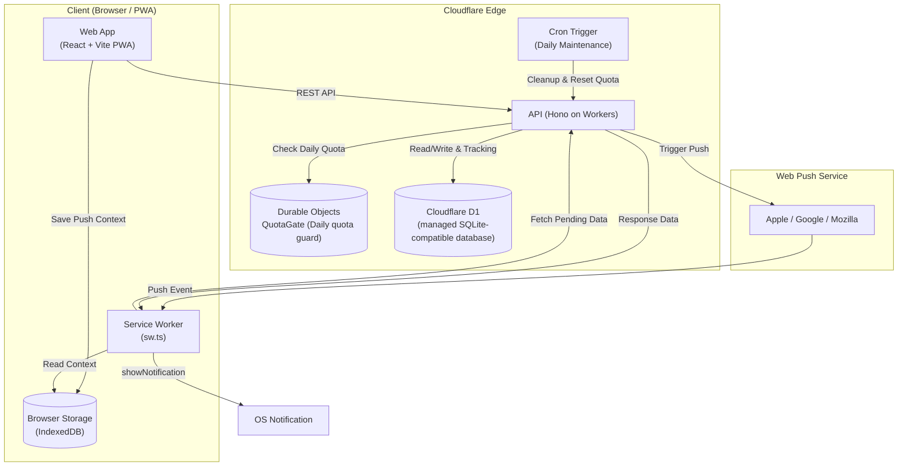

## ⚠️ プロジェクトのステータス

本プロジェクトは現在 **アーカイブ（開発・運用を恒久的に終了）** されています。

- **運用の停止**: 現在、Cloudflare上でのサービス提供（`renrakun.pages.dev` およびAPI）は恒久的に終了しており、デプロイ（Workers/Pages/D1）は削除済みのため、アクセスできない状態です。
- **補足**: 本プロジェクトは限定的な検証目的でのみ利用しました。
- **目的**: 本リポジトリは、個人開発のポートフォリオ（設計・実装の記録）として公開しています。
- **免責事項**: 本コードは現状有姿で提供され、明示または黙示を問わず一切の保証を行いません。法令で許容される範囲で、本コードの利用に起因するいかなる損害についても作者は責任を負いません。

---

# れんらくん (renrakun)

`renrakun` は、家庭内の「買ってほしい / 行きたい」依頼をタップ操作だけで共有する PWA です。日常チャットに埋もれやすい依頼を、専用UIと受信箱で管理します。

## できること (MVP)
- タッチパネルUIで項目や場所を選び、素早く依頼送信
- 招待リンク + 合言葉でグループ参加（iOSホーム画面アプリ利用時はトークン手動参加も併用可）
- 依頼ステータス管理（`依頼中` / `対応中` / `完了`）
- Push通知でロック画面に依頼要約（誰が・何を）を表示
- ログイン後に通知セットアップガイドを常設表示（iOS / Android / PC）
- グループ作成者によるカスタム管理（タブ/アイテム/場所の追加・削除）
- 依頼テンプレ切替（`買ってほしい` / `行きたい`）
- カート操作の可視化（アイテム `＋` で追加、カート `−` で減算）
- `行きたい` は場所のみ送信（切替時にアイテムはクリア、場所は単一選択）
- 無料枠保護（日次制限・自動復帰・段階的クリーンアップ）

## 🛠 アーキテクチャと技術選定の理由

本プロジェクトは、個人運用かつ家族で使うことを前提とした連絡アプリです。 **「家族が迷わず使える導入ハードルの低さ」** と **「無料枠内での低コスト運用と、メンテナンスの手間を極小化すること」** を両立するため、以下の設計思想に基づき選定しています。

* **Web (Frontend): React + TypeScript + Vite + `vite-plugin-pwa` (Cloudflare Pages)**
  * **選定理由:** 家族に「アプリをストアからDLして」と頼むのは大きな心理的障壁です。URLを共有するだけで即座に利用開始できる手軽さを優先し、PWAを採用しました。
  * **設計の工夫:** Service Workerによるキャッシュ戦略により、通信環境が不安定な場所でも安定した操作感を提供しています（※iOS特有のPush・バックグラウンド制約については、運用でカバーするガイドをアプリ内に常設）。
* **API (Backend): Hono (running on Cloudflare Workers) + D1**
  * **選定理由:** V8 Isolatesを活用したCloudflareのエッジ環境を選定。コールドスタートの影響を抑え、日常使いでストレスのない低レイテンシなレスポンスを実現しています。
  * **運用の工夫:** SQLite互換のマネージド・サーバーレスデータベースである「D1」を採用し、インフラ構成をCloudflareエコシステム内に完結させることで、運用コストとインフラ管理のオーバーヘッドを最小限に抑えています。
* **Abuse Protection: Cloudflare Durable Objects (`QuotaGate`)**
  * **選定理由:** D1の無料枠（書き込み上限）を、予期せぬ無限ループやスパムリクエストから保護するための仕組みです。
  * **設計の工夫:** 外部Redisを導入せず、Durable Objectsを「グローバルで単一の状態保持ポイント」として活用。Storage APIを用いて日次の書き込みカウントを永続化し、上限到達時にはリクエストを安全に遮断し、日次（JST）で自動復帰するステートフルな保護ゲートを構築しました。
* **Shared (Type Safety): `packages/shared` (Zod)**
  * **選定理由:** `pnpm workspace` によるモノレポ構成。OpenAPI等のツールによるコード生成のオーバーヘッドを避け、Zodスキーマを直接共有するアプローチをとりました。
  * **メリット:** コンパイル時の型推論（`z.infer`）に加え、**Zodによる実行時（ランタイム）のペイロード検証**を両立。API仕様変更による型やスキーマの不整合を早期に検知できる、堅牢な開発環境を構築しています。
* **Push Notifications: Service Worker + Web Push API**
  * **選定理由:** Firebase等の追加のサードパーティSaaSに依存せず、VAPID署名を用いた自前実装を選択しました（鍵はWorkers Secretsでセキュアに管理）。
  * **プライバシーの考慮:** 通知ペイロードには最小限の合図のみを含め、詳細な依頼内容はアプリ起動後（またはService Workerの裏側）にAPIからセキュアに取得する設計とし、端末側やOSのPush基盤における機微情報の露出リスクを最小化しています。



## ローカル開発セットアップ

1. 依存関係インストール

```bash
pnpm install
```

2. 環境変数ファイル作成

```bash
cp apps/web/.env.example apps/web/.env
cp apps/api/.dev.vars.example apps/api/.dev.vars
```

- `apps/web/.env` の `VITE_API_BASE_URL` を `http://127.0.0.1:8787` に設定
- `apps/api/.dev.vars` の `APP_ORIGIN` を `http://localhost:5173` に設定
- Pushテスト時は `pnpm dlx web-push generate-vapid-keys --json` で鍵を生成し、`.dev.vars` と `.env` に設定

3. ローカルDBへマイグレーション適用

```bash
cd apps/api
pnpm wrangler d1 migrations apply renrakun --local
```

4. 開発サーバー起動

```bash
# Terminal 1: API
pnpm dev:api

# Terminal 2: Web
pnpm dev:web
```

## 本番セットアップ

*(アーカイブ済み：以下の手順は参考用であり、現在は運用・保守していません。)*

1. 本番D1へマイグレーション適用（初回 + スキーマ変更時）

```bash
cd apps/api
pnpm wrangler d1 migrations apply renrakun --remote
```

2. Push用Secrets登録

```bash
cd apps/api
pnpm wrangler secret put VAPID_PRIVATE_KEY
# ※ プロジェクト外から実行する場合は pnpm dlx wrangler secret put ... を使用
pnpm wrangler secret put VAPID_PUBLIC_KEY
pnpm wrangler secret put VAPID_SUBJECT
```

## CI/CD

- API: GitHub Actions から Workers へ自動デプロイ
- Web: Cloudflare Pages で自動ビルド/デプロイ
- APIマイグレーションは CI で次を実行（非対話環境での確認プロンプトをスキップ）

```bash
pnpm wrangler d1 migrations apply renrakun --remote
```

CI（非対話環境）では通常、対話プロンプトなしで実行されます。

## Pushトラブルシュート

通知が届かない場合は次の順で確認してください。

0. ログイン後上部の「通知の使い方」カードでOS別手順を確認
   - iOS: Safariで開き、「ホーム画面に追加」したWebアプリから通知を有効化（必須）
   - Android/PC: ブラウザ通知を許可し、アプリ内 `通知を有効化/再同期` を実行
   - PC通知はベストエフォートです。スマホ利用（iOSはホーム画面アプリ）が最も安定します。
   - iOSでホーム画面アプリを使う場合、Safariで開いた画面とホーム画面アプリは別扱いです。招待リンクまたはトークンを共有し、ホーム画面アプリ側の「グループ参加」で入力してください。
1. アプリ内 `通知を再同期` を実行
2. `参加中メンバー` カードで通知状態（通知OK / 通知未設定）を確認
3. マイグレーション適用状況（`--local` / `--remote`）を確認
4. `wrangler tail` で APIログを確認

通知配信ルール:
- 新しい依頼: 送信者以外の通知ONメンバーへ配信
- 対応中/完了: 依頼送信者へ配信

## PWAのライフサイクルとデータ同期

- クライアントの更新は Service Worker のアップデートフローによって行われます。
- 新しい Service Worker は `skipWaiting` によってアクティブ化されます。UIの更新（リロード）は、ユーザーの操作を妨げないよう、アプリがバックグラウンド（`visibilityState: hidden`）になったタイミングで実行されます。
- プライベートデータの更新ポリシー：
  - Service Worker からの `REFRESH_DATA` 通知によるプッシュ型更新
  - 画面のフォーカス時、オンライン復帰時、または可視性変更時の自動更新
  - 表示中のみ実行される 45秒間隔（※現在の設定値）のポーリング
- 同期処理はスロットリング（最小 5秒間隔 / 現在値）され、明示的なロード中は抑制されます。

## 仕様・制限事項（※各数値は現在のデフォルト設定値に依存）

- **通知対応**: iOSのWeb Pushはホーム画面に追加したWebアプリ起動が前提です。Android/PCはブラウザ通知許可で利用できます。
- **プライバシー**: 通知要約はロック画面に表示されるため、機微情報の送信は避けてください。
- **書き込み制限**: 無料枠保護のため、API書き込みは日次上限に達すると一時停止し、翌 0:00 JST に自動復帰します（※JST基準の実装に基づく）。
- **依頼の保持**: 「完了」済みの依頼は既定で14日後に自動削除されます。「依頼中」「対応中」は自動削除しません。
- **未使用グループ**: `last_activity_at` を基準に、メンバー1名のみ・通知設定なし等の条件を満たす場合に段階整理されます（現在の設定: 候補化60日 + 猶予30日）。
- **カスタム場所の整理**: 削除操作はアーカイブ方式です。参照がなく保持期間を超えたアーカイブ済みカスタム場所は、日次メンテで段階的に物理削除されます。
- **スコープ**: 本MVPに価格比較・在庫管理・EC連携は含みません。

## ⚙️ Config & Magic Numbers (設定値の参照先)
本ドキュメントに記載されている各数値（制限や保持期間）は、以下のソースコード上の定数または実装に依存しています。将来の仕様変更時は各ファイルを参照してください。

* **API日次リセット (JST):** `apps/api/src/time.ts` (`getJstDateString`) および `apps/api/src/quota-do.ts`
* **Cronクリーンアップ期間 (完了後14日 / グループ整理60+30日):** `apps/api/src/index.ts` (`/cron/daily` エンドポイント内のSQLクエリ)
* **PWAのポーリング間隔 (45秒 / スロットル5秒):** `apps/web/src/App.tsx` および関連するフック内の定数
