# renrakun (れんらくん)

Tap-first household request app.
会員登録なしで、家庭内の「買ってほしい / 行きたい」依頼をすばやく共有できるPWAです。

- **App URL:** [renrakun.pages.dev](https://renrakun.pages.dev)
- **日本語ドキュメント:** [README.ja.md](README.ja.md)
- **English documentation:** [README.en.md](README.en.md)

## Feature Gallery / 特徴ギャラリー

### 1) No account start / 会員登録なしですぐ開始
Display name + passphrase only. Invite link sharing is built-in.
表示名 + 合言葉だけで開始できます。招待リンク共有も標準対応です。

  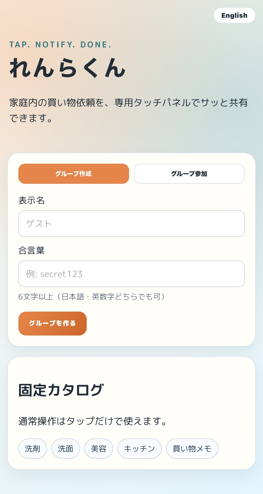
  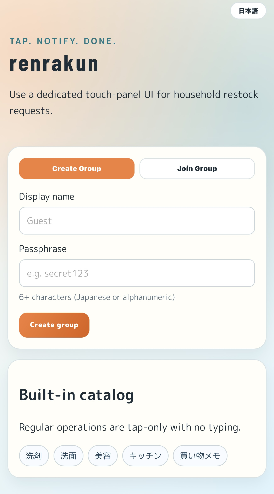

### 2) Member visibility + notification readiness / 参加メンバーと通知状態の可視化
See who is in the group and who has notifications enabled.
グループ参加者と通知状態（通知OK / 未設定）を一目で確認できます。

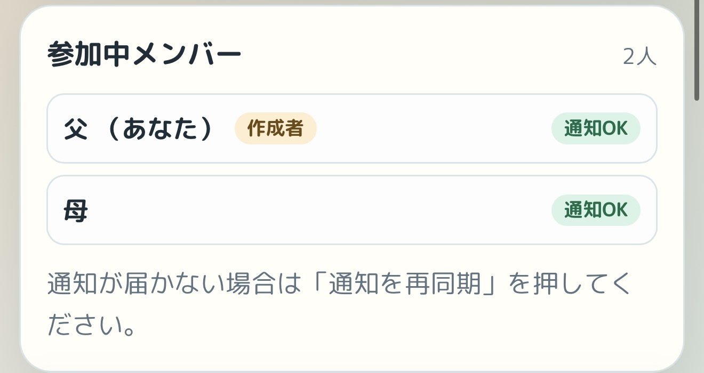

### 3) Tap-only cart controls / タップ中心のカート操作
`+` adds, `-` reduces. Store/place is single-select and easy to clear.
`+` で追加、`-` で減算。場所選択は単一選択で、解除も簡単です。

  
  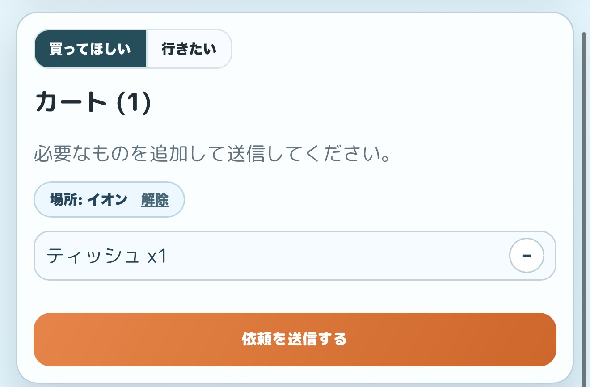

### 4) Intent switch: Need to buy / Want to visit / 依頼テンプレ切替
Switch between `Need to buy` and `Want to visit`.
`行きたい` は場所のみ送信です。

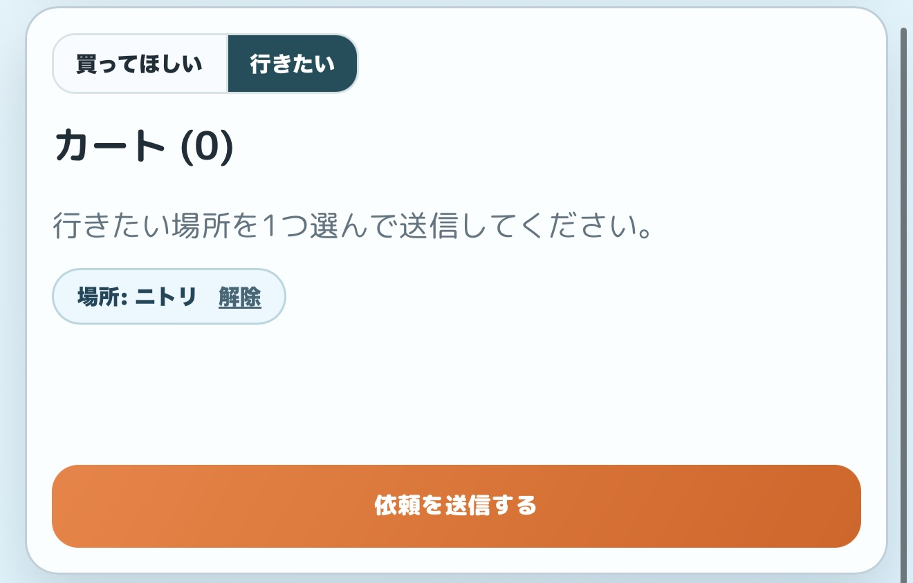

### 5) Admin customization per group / 作成者によるグループ別カスタム管理
Group creator can add/archive-delete custom tabs, items, and places.
グループ作成者は、カスタムタブ・アイテム・場所を追加/削除できます。

  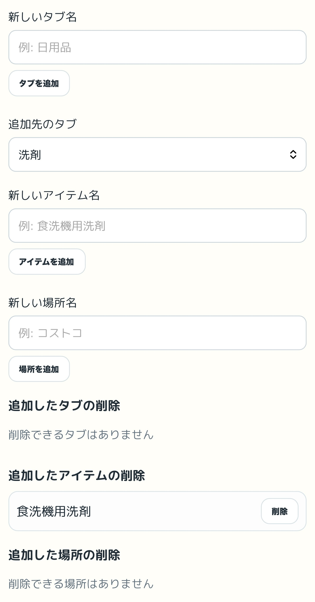
  

### 6) Inbox status workflow / 受信箱ステータス管理
Track requests through `Requested` -> `In progress` -> `Completed`.
受信箱で `依頼中` -> `対応中` -> `完了` を管理できます。

  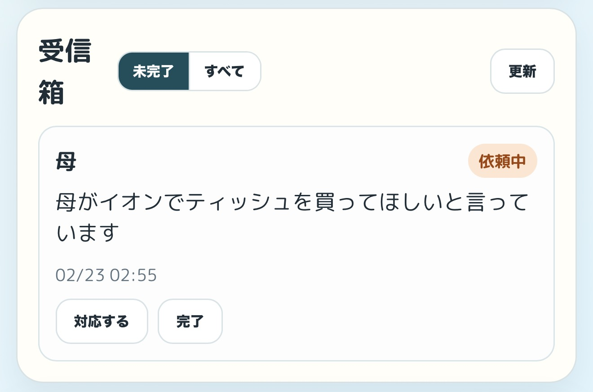
  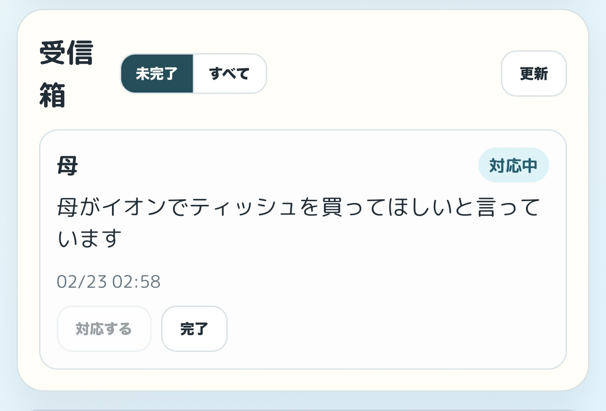
  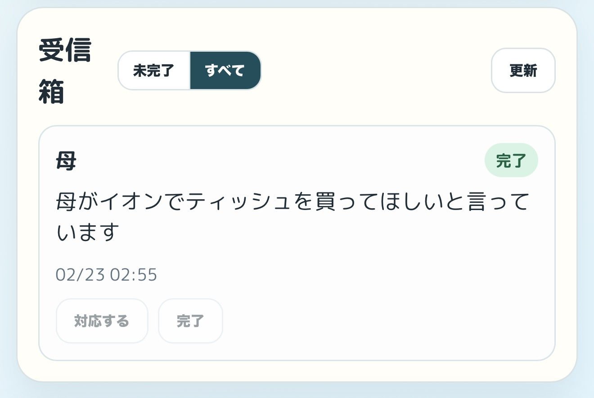

### 7) Lock-screen push summary / ロック画面通知（要約）
Push shows a concise summary (who + what) to reduce app-open friction.
ロック画面で「誰が・何を」を要約表示し、確認の手間を減らします。

  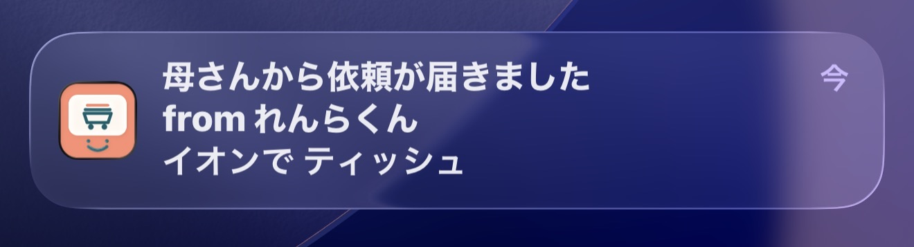
  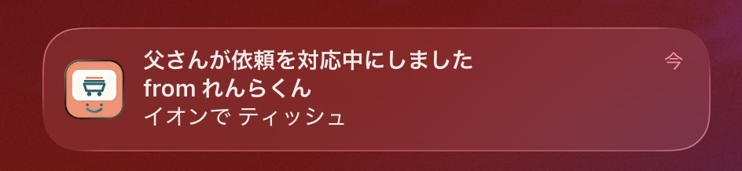
  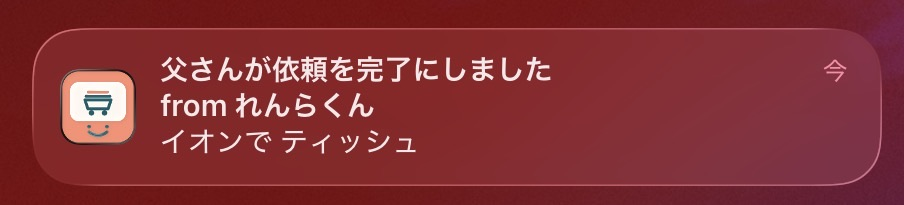

## Notes / 補足

- This top-level README is portfolio-focused and screenshot-first.
- 技術詳細、運用手順、制限事項は `README.ja.md` / `README.en.md` を参照してください。
